<!-- HEADER -->

  

 

<!-- CLEAN TYPO ANIMATION -->

  

 

---

# **Profile**
An enthusiastic student currently completing the third year of a 4-year Bachelor of Science (Honours) in computing at (NCI) National college of Ireland.

Currently studying: Advanced Programming, Advanced Computer networks, Artificial Intelligence, Security fundamentals and development.

- **Interests:** Teaching AI systems humility, one adversarial prompt at a time  
- **Location:** Dublin, Ireland 🇮🇪  
- **Current Work:** Java systems, database design, backend architecture  
- **Open To:** collaboration, backend development roles, system-focused projects  

---

# **Technical Competencies**

 <table> <tr> <td align="center" width="25%">   <strong>Programming & Systems</strong>  Java (OOP, backend) Python (automation, tooling) Data Structures & Algorithms Systems Design Fundamentals </td> <td align="center" width="25%">   <strong>Databases</strong>  MySQL • PostgreSQL Query Optimization Schema Design Performance Tuning </td> <td align="center" width="25%">   <strong>Web Fundamentals</strong>  Semantic HTML Responsive CSS REST API Patterns </td> <td align="center" width="25%">   <strong>Tools & Platforms</strong>  Git • GitHub IntelliJ • VS Code • NetBeans Linux • Windows CI/CD Basics </td> </tr> </table> 

---

# **Technology Suite**

<table>
  <tr>
    <td align="center" width="25%">
      
       Java
    </td>
    <td align="center" width="25%">
      
       Python
    </td>
    <td align="center" width="25%">
      
       MySQL
    </td>
    <td align="center" width="25%">
      
       PostgreSQL
    </td>
     <td align="center" width="25%">
      
       Spring Boot
    </td>
    <td align="center" width="25%">
  
   Node.js
</td>
<td align="center" width="25%">
  
   HTML5
</td>
<td align="center" width="25%">
  
   CSS3
</td>
<td align="center" width="25%">
  
   XML
</td>
  </tr>
</table>

---

# **Development Environment**

 

---
# **Current Focus**

```mermaid
graph TD
A[Learning] --> D[Portfolio Development]
B[Building] --> D
C[Practicing] --> D

A1[Advanced Java Concepts] --> A
A2[System Design Principles] --> A
A3[API Architecture] --> A

B1[Portfolio Projects] --> B
B2[Backend Systems] --> B
B3[Database-driven Apps] --> B

C1[LeetCode Challenges] --> C
C2[Algorithm Optimization] --> C
C3[Code Reviews] --> C

style A fill:#0C0C0C,stroke:#C6A667,stroke-width:2px,color:#FFFFFF
style B fill:#0C0C0C,stroke:#C6A667,stroke-width:2px,color:#FFFFFF
style C fill:#0C0C0C,stroke:#C6A667,stroke-width:2px,color:#FFFFFF
style D fill:#0C0C0C,stroke:#C6A667,stroke-width:2px,color:#FFFFFF
style A1 fill:#0C0C0C,stroke:#C6A667,stroke-width:1.5px,color:#FFFFFF
style A2 fill:#0C0C0C,stroke:#C6A667,stroke-width:1.5px,color:#FFFFFF
style A3 fill:#0C0C0C,stroke:#C6A667,stroke-width:1.5px,color:#FFFFFF
style B1 fill:#0C0C0C,stroke:#C6A667,stroke-width:1.5px,color:#FFFFFF
style B2 fill:#0C0C0C,stroke:#C6A667,stroke-width:1.5px,color:#FFFFFF
style B3 fill:#0C0C0C,stroke:#C6A667,stroke-width:1.5px,color:#FFFFFF
style C1 fill:#0C0C0C,stroke:#C6A667,stroke-width:1.5px,color:#FFFFFF
style C2 fill:#0C0C0C,stroke:#C6A667,stroke-width:1.5px,color:#FFFFFF
style C3 fill:#0C0C0C,stroke:#C6A667,stroke-width:1.5px,color:#FFFFFF


```

<!-- MERMAID FOCUS GRAPH -->

